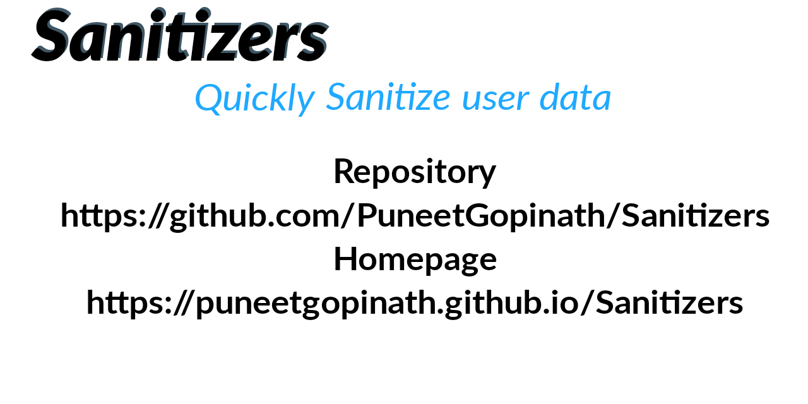

<p align="center">
    <a href="https://puneetgopinath.github.io/Sanitizers"></a>
</p>

<h2 align="center">Sanitizers</h2>

<p align="center">
    Quickly Sanitize user data<br>
    <i><u>v1.0.0</u></i>
    <br><br>
    <a href="https://puneetgopinath.github.io/Sanitizers"><b>Explore Sanitizers Docs</b></a> &raquo;
    <br><br>&rArr;
    <a href="https://github.com/PuneetGopinath/Sanitizers/issues/new?template=bug_report.md">Report bug</a> • <a href="https://github.com/PuneetGopinath/Sanitizers/releases">Releases</a> • <a href="https://github.com/PuneetGopinath/Sanitizers/issues/new?template=feature_request.md">Request feature</a>
</p>

# Table of contents

 * [Quick Start](#quick-start)
 * [Source Files Structure](#files)
 * [Status](#status)
 * [PHP Support](#php)
 * [Contributing](#contribute)
 * [NOTES](#notes)

<h2><a name="quick-start">Quick Start</a></h2>

- [Download the latest version](https://github.com/PuneetGopinath/Sanitizers/archive/v1.0.0.zip)

- #### Clone the repo:
`git clone https://github.com/PuneetGopinath/Sanitizers.git`

- ### What is Sanitize ??
Sanitize is a function to check (and remove) harmful data from user input which can harm the software.<br>
Sanitizing user input is the most secure method of user input validation to strip out anything that is not on the whitelist.

- ### Usage
Just include the file and Sanitize the user input.
Example Usage in php:

```
<?php
use Sanitizers\Sanitizers\Sanitizer;

require_once("Sanitizers.php");

\\ passing `true` in Sanitizer class enables exceptions
$sanitize = new Sanitizer(true);
try {
    echo $sanitize->Username($_GET['username']);
} catch (Exception $e) {
    echo "Could not Sanitize user input. Error: " . $e;
}
?>
```

<h2><a name="files">Source Files Structure</a></h2>

```text
Sanitizers/
└── src/
    ├── Sanitizers.php
    └── config.php
```

<h2><a name="status">Status</a></h2>

[]()
[](https://github.com/PuneetGopinath/Sanitizers/stargazers)
[](https://github.com/PuneetGopinath/Sanitizers/issues)
[](https://github.com/PuneetGopinath/Sanitizers/blob/main/LICENSE)
[]()
[]()

[]()
[]()
[]()
[]() [](https://gitter.im/BaalKrshna/Sanitizers?utm_source=badge&utm_medium=badge&utm_campaign=pr-badge&utm_content=badge)


<h2><a name="php">PHP Support</a></h2>
We have tested our files,
And we have found these many versions have no errors.
5.4.0 - 5.4.45, 5.5.0 - 5.5.38, 5.6.0 - 5.6.40, 7.0.0 - 7.0.33, 7.1.0 - 7.1.33, 7.2.0 - 7.2.34, 7.3.0 - 7.3.27, 7.4.0 - 7.4.15, 8.0.0 - 8.0.2

So We can say that minimum we require php 5.4.0

<h2><a name="contribute">Contributing</a></h2>
See the <a href="https://github.com/PuneetGopinath/Sanitizers/tree/main/.github/CONTRIBUTING.md">CONTRIBUTING.md</a> file.

<h2><a name="notes">NOTES</a></h2>

See the [NOTES.md](https://github.com/PuneetGopinath/Sanitizers/blob/main/NOTES.md) file.
